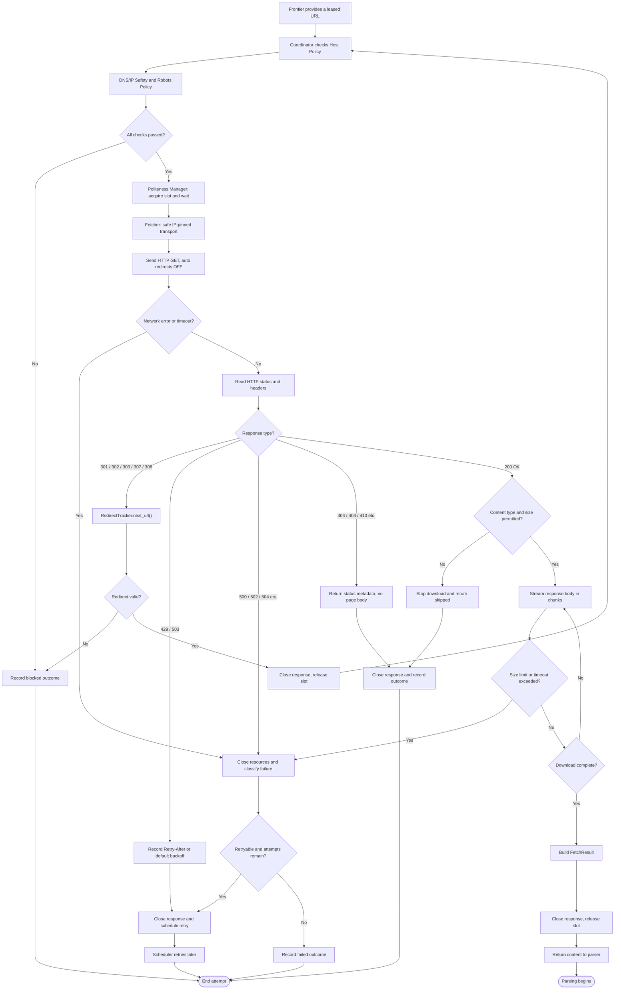

# Developer's Eye: Async Fetcher Flowchart

```mermaid
flowchart TD
    A["Frontier provides a leased URL"] --> B["Coordinator checks Host Policy"]
    B --> C["DNS/IP Safety and Robots Policy"]
    C --> D{"All checks passed?"}
    D -- No --> E["Record blocked outcome"]
    D -- Yes --> F["Politeness Manager: acquire slot and wait"]
    F --> G["Fetcher: safe IP-pinned transport"]
    G --> H["Send HTTP GET, auto redirects OFF"]
    H --> I{"Network error or timeout?"}
    I -- Yes --> ER["Close resources and classify failure"]
    I -- No --> J["Read HTTP status and headers"]
    J --> K{"Response type?"}

    K -- "301 / 302 / 303 / 307 / 308" --> L["RedirectTracker.next_url()"]
    L --> M{"Redirect valid?"}
    M -- No --> E
    M -- Yes --> N["Close response, release slot"]
    N --> B

    K -- "429 / 503" --> O["Record Retry-After or default backoff"]
    O --> P["Close response and schedule retry"]

    K -- "500 / 502 / 504 etc." --> ER
    K -- "304 / 404 / 410 etc." --> Q["Return status metadata, no page body"]
    K -- "200 OK" --> R{"Content type and size permitted?"}

    R -- No --> S["Stop download and return skipped"]
    R -- Yes --> T["Stream response body in chunks"]
    T --> U{"Size limit or timeout exceeded?"}
    U -- Yes --> ER
    U -- No --> V{"Download complete?"}
    V -- No --> T
    V -- Yes --> W["Build FetchResult"]
    W --> X["Close response, release slot"]
    X --> Y["Return content to parser"]

    ER --> Z{"Retryable and attempts remain?"}
    Z -- Yes --> P
    Z -- No --> AA["Record failed outcome"]
    Q --> AB["Close response and record outcome"]
    S --> AB
    P --> AC["Scheduler retries later"]
    E --> END(["End attempt"])
    AA --> END
    AB --> END
    Y --> FIN(["Parsing begins"])
    AC --> END
```
